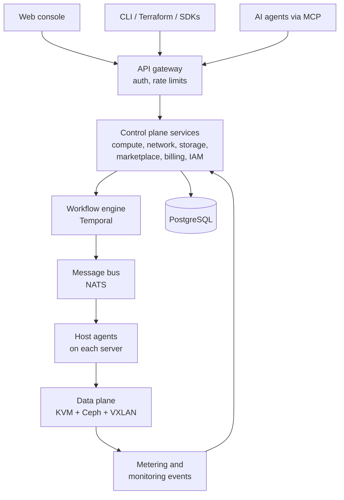
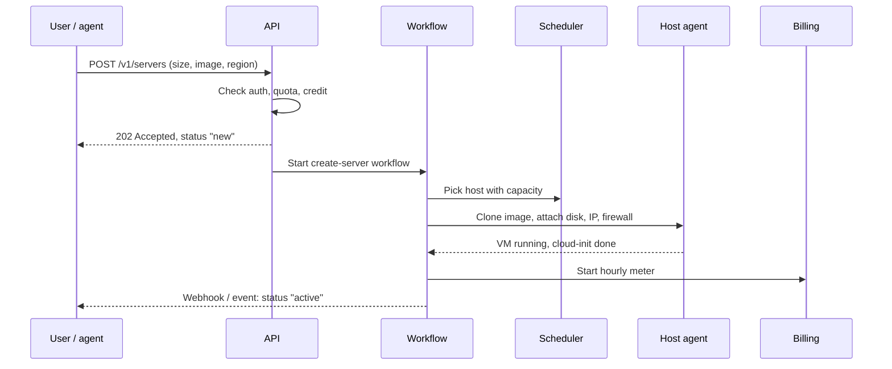

# Cloud Platform Architecture — AI-Native Developer Cloud

_Source: "Cloud Platform Architecture — AI-Native Developer Cloud", Sep 25, 2026 (Yassir)._

## Summary and design principles

We build our own API-first control plane on top of proven open-source infrastructure
(KVM via Proxmox VE, Ceph storage), so we code the product and the developer
experience, not the hypervisor. The same API powers the web console, CLI, Terraform,
SDKs and AI agents.

1. **API-first**: every action exists in the public API before it appears in the console.
   The console is just one API client.
2. **Control plane separate from data plane**: customer servers keep running even if our
   portal or API goes down.
3. **Swappable engine**: all hypervisor calls go through a driver interface, so we can move
   from Proxmox to OpenStack or bare-metal KVM later without rewriting the product.
4. **Everything is a workflow**: provisioning, resizing and deletion run as durable,
   retryable workflows, never as fire-and-forget scripts.
5. **AI-native by design**: AI agents are first-class API clients with scoped permissions
   and spending limits, not a chatbot bolted on.
6. **Metered from day one**: every resource emits usage events for hourly billing.
7. **Multi-region ready**: the Saudi region is region one; the data model supports more regions
   from the start.

## System overview

Four layers: client surfaces, an API gateway, the control plane (our code), and the data
plane (the hardware running customer workloads).

Requests flow top to bottom; usage and health events flow back up from the host agents
into billing and monitoring.

## Control plane services

The control plane starts as a **modular monolith** (one codebase, clear module
boundaries) and splits into separate services only when load requires it.

| Module | Owns | MVP? | Code |
|---|---|---|---|
| Identity and IAM | Users, teams, projects, roles, API tokens, 2FA, SSH keys | Yes | `apps/api/src/modules/iam` |
| Compute | Server ("instance") lifecycle, sizes, images, snapshots, resize, rebuild | Yes | `modules/compute` |
| Scheduler | Chooses which physical host gets each new server (capacity, anti-affinity) | Yes | `modules/scheduler` |
| Networking | Public IPs, floating IPs, firewalls, VPCs, load balancers, DNS | IPs and firewall | `modules/network` |
| Storage | Block volumes, backups, object storage (S3-compatible) | Snapshots only | `modules/storage` |
| Marketplace | App catalog, vendor submissions, one-click deploy templates | Yes | `modules/marketplace` |
| Billing and metering | Usage events, rating, invoices, credits, payments, spend alerts | Yes | `modules/billing` |
| AI services | MCP server, console assistant, inference gateway | MCP in phase 2 | — |
| Trust and safety | KYC, fraud scoring, abuse reports, suspension | Yes | `modules/trust` |
| Back-office | Admin console for support, capacity and finance teams | Yes | `modules/admin` |
| Events and webhooks | Audit log, customer webhooks, notifications (email, SMS) | Yes | `modules/events` |

## Data plane: compute, storage, networking

The data plane runs entirely on open-source components; our only custom code here is
the **host agent** (`agents/host-agent`) that takes orders from the control plane.

- **Compute**: KVM VMs managed by a Proxmox VE cluster (3 nodes minimum). Customer
  servers boot from golden images (Ubuntu, Debian, Rocky, marketplace images) and are
  configured on first boot with cloud-init.
- **Host agent**: a small Go service on every node that receives jobs from the message
  bus, calls the Proxmox API, and reports status, health and usage every minute.
- **Block storage**: Ceph RBD, replicated 3× across nodes. Snapshots and backups are Ceph
  snapshots copied to a separate backup cluster.
- **Object storage (phase 3)**: Ceph RADOS Gateway, S3-compatible ("Spaces"-style buckets).
- **Networking**: each customer VPC is an isolated VXLAN overlay (Proxmox SDN with
  EVPN); public IPs routed from our own IP blocks; firewalls enforced on the host,
  outside the customer's reach.
- **Load balancers (phase 2)**: managed HAProxy instances deployed as internal VMs.
- **DNS**: PowerDNS with an API, for customer domains and reverse DNS.
- **Metadata service**: local endpoint each VM calls to fetch SSH keys, user data and
  network config.
- **DDoS**: upstream filtering from the data center provider in year 1.

## Provisioning flow

Creating a server takes about 30–60 seconds and runs as one durable workflow; if any
step fails, it retries or rolls back cleanly and the customer is never billed for a broken
server.

Implementation: `apps/api/src/workflows/create-server.workflow.ts` + activities.

## Marketplace

A marketplace app is a pre-built server image plus a setup script; "one click" means
creating a normal server from that image with the app already installed.

- **App package**: a manifest (name, category, minimum size, ports, variables such as
  admin email), a Packer build file that bakes the image, and a cloud-init script.
- **Storage**: every app lives in a Git repository; merges trigger an automated build, a
  security scan (CVE check, no default passwords), and a test deploy before publishing.
- **Vendor program**: vendors submit apps through a vendor portal; paid apps get a
  revenue share (e.g. 70% vendor / 30% us).
- **Launch catalog (~15 apps)**: WordPress, WooCommerce, Docker, Node.js, Laravel,
  Django, n8n, Nextcloud, Mattermost, Odoo, OpenVPN/WireGuard, Plausible, Ghost,
  Coolify, AI starter (Ollama + Open WebUI).
- **Progrid apps**: Progrid's white-label platforms become premium marketplace listings.
- **Later**: Kubernetes apps (Helm charts) and multi-server "stacks".

## AI-native layer

| Capability | What it does | Phase |
|---|---|---|
| MCP server | Exposes the platform API as tools for Claude, Cursor or any agent | 2 |
| Agent-safe tokens | Scoped API tokens with spend caps, allowed actions and required human approval for destructive steps | 2 |
| Console assistant | Plain-language requests turned into a plan the user confirms | 2 |
| AI docs and support | Chat over docs in Saudi, Arabic, English; drafts first-line support replies | 1–2 |
| AI ops | Detects abuse (crypto-mining, spam), predicts capacity, flags failing disks | 2 |
| AI app templates | Ollama, vLLM, LangGraph, n8n with AI nodes | 1 |
| Inference gateway | OpenAI-compatible endpoint routing to our GPUs or partner APIs, billed per token | 3 |
| GPU servers | Rented GPU nodes sold hourly | 3 |

The data model for agent-safe tokens (scopes, spend caps, approval requirement) ships in
the MVP so phase 2 is additive.

## Developer experience

- **REST API v1**: OpenAPI spec first (`packages/openapi`); consistent resources
  (`/servers`, `/volumes`, `/firewalls`, `/apps`), pagination, idempotency keys, clear
  error codes.
- **Generated SDKs**: Go, Python, JavaScript from the same spec.
- **CLI**: single Go binary (`pgcloud servers create --size s-2vcpu-4gb --image ubuntu-24-04`).
- **Terraform provider**.
- **Webhooks and events**: server created, backup finished, invoice issued, spend limit reached.
- **Console**: fast, minimal, dark/light, TR / AR (RTL) / EN.
- **Docs and tutorials** in three languages. **Status page** per region.

## Billing and metering

Customers pay hourly, capped at the monthly plan price. Billing is built in-house
(SAR, USD, ZATCA e-invoices).

1. **Metering**: host agents emit a usage event every minute per resource.
2. **Aggregation**: events roll up hourly into usage records (TimescaleDB hypertable).
3. **Rating**: a price book converts usage into charges; hourly price = monthly ÷ 672,
   capped at the monthly price.
4. **Invoicing**: monthly, SAR (ZATCA Fatoora via a licensed e-invoicing provider) or USD.
5. **Payments**: Moyasar for Saudi cards (mada), Moyasar for international cards too, prepaid credits.
6. **Controls**: spend alerts, hard spend limits for agent tokens, promo credits,
   automatic suspension after failed payment + grace period.

## Security, isolation and compliance

- **Tenant isolation**: one KVM VM per server; one overlay per VPC; host-enforced firewalls.
- **Access**: RBAC per team and project, mandatory 2FA for owners, short-lived tokens,
  full audit log of every API call.
- **Secrets**: HashiCorp Vault / OpenBao; no passwords in code or images.
- **Data protection**: disks encrypted at rest, encrypted off-site backups, Saudi
  customer data kept in Saudi Arabia (PDPL).
- **Abuse prevention**: phone/ID verification, payment checks, outbound limits for new
  accounts, mining/spam detection.
- **Platform hardening**: separate management network, admin via VPN only, pen tests.
- **Target**: ISO 27001 in year 2.

## Tech stack

| Layer | Choice | Why |
|---|---|---|
| Web console | Next.js + React, Tailwind | Progrid's stack; RTL Arabic |
| Control plane API | NestJS (TypeScript) + Prisma | Progrid's stack; fast to build with Claude Code |
| Database | PostgreSQL + TimescaleDB | One DB for resources and usage time-series |
| Workflows | Temporal | Durable, retryable provisioning |
| Message bus | NATS | Lightweight messaging to host agents |
| Cache and locks | Redis | Sessions, rate limits, scheduler locks |
| Host agent, CLI | Go | Single static binaries |
| Terraform provider | Go (plugin framework) | Required by Terraform |
| Hypervisor + storage | Proxmox VE (KVM) + Ceph | Open source, mature |
| Images | Packer + cloud-init | Repeatable images |
| Observability | Prometheus, Grafana, Loki | Metrics, dashboards, logs |
| Platform IaC | Ansible + Terraform | Rebuild any node from scratch |
| Secrets | Vault / OpenBao | Central, audited secrets |

## Build phases

| Phase | Months | Scope |
|---|---|---|
| MVP | 1–3 | Accounts, teams, SSH keys; servers (create, resize, reboot, delete); images and snapshots; public IPs and firewalls; 15 marketplace apps; hourly billing, SAR/USD invoices, payments; API v1 and console; admin back-office; abuse checks |
| Phase 2 | 4–9 | VPCs, block volumes, automatic backups, load balancers, DNS; CLI, SDKs, Terraform provider; MCP server, agent-safe tokens, console assistant; webhooks; status page |
| Phase 3 | 10–18 | Managed databases, object storage, managed Kubernetes; vendor marketplace with revenue share; inference gateway; GPU servers; second region |

MVP team: 1 DevOps/network engineer (data plane), 1–2 Progrid engineers with Claude
Code (control plane, console, billing), founder as product owner.

## Open decisions before coding

- Brand and domain name for the cloud (CLI name, API domain) — **`pgcloud` used as placeholder**
- Data center and server provider in the Saudi region; own IP blocks and nested networking allowed?
- Proxmox VE vs Apache CloudStack as first engine — **repo assumes Proxmox behind a driver interface**
- Own IP block (RIPE membership) or leased IPs for year 1
- ZATCA e-invoice provider and Saudi payment gateway
- Which 15 marketplace apps launch first
- Whether the MCP server and console assistant move into the MVP
